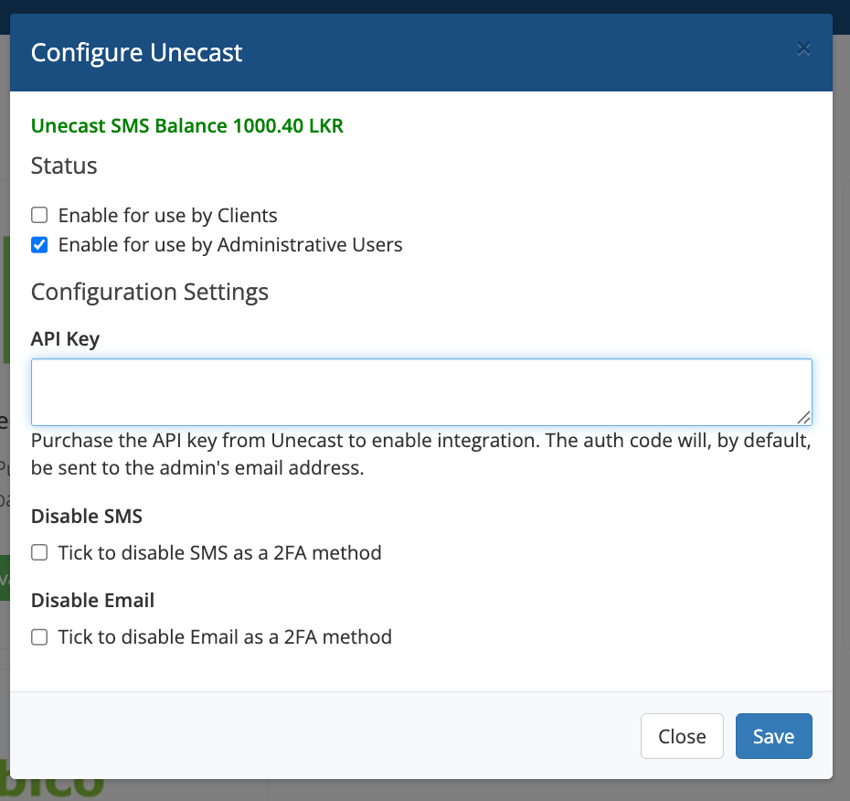
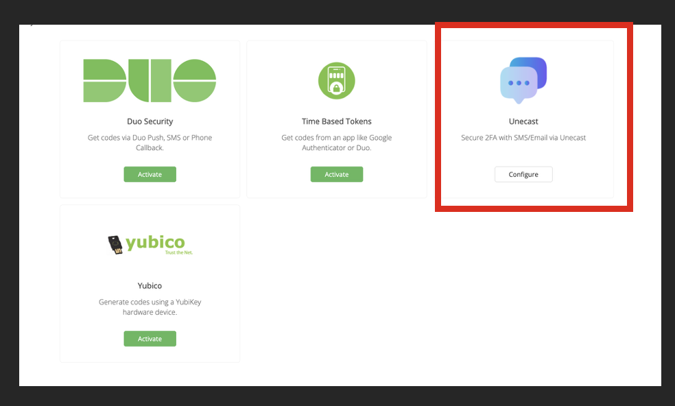
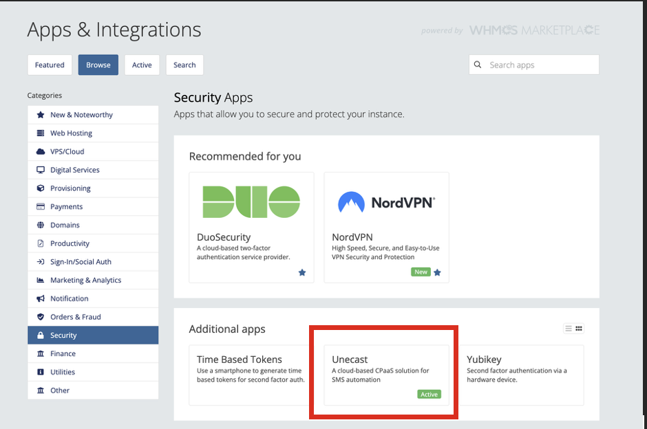
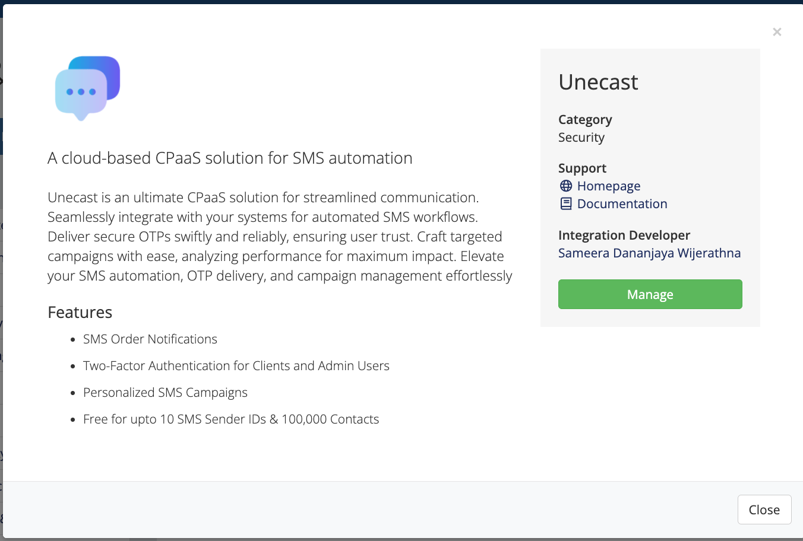

# Unecast WHMCS 2FA Module





This WHMCS security module enables **Two-Factor Authentication (2FA)** for administrators using Unecast.  
It supports **SMS** and **Email** as delivery methods for OTPs (One-Time Passwords).

---
## 📂 Getting Started
- Upload the **Unecast Two-Factor Authentication Addon** to:   `/modules/security/`

---

## ⚙️ Configuration
1. Navigate to **Setup → Staff Management → Two-Factor Authentication**.
2. Select **Unecast** and click **Configure**.
3. Enter the following:
   - **Admin Mobile Phone** (e.g., `947XXXXXXXX`)
   - **API Key** (provided by Unecast)
   - Enable/disable **SMS** or **Email** as needed.
4. Click **Save**.

---
## ⚡ Features
- Sends OTP to the admin’s registered **mobile number**.
- Supports **Email** delivery as a fallback or alternative.
- Mobile number is securely stored in `tbladmins.authdata` (JSON format).
- Compatible with **WHMCS 8.x+**.


---

## 🗄️ Database Storage
The admin mobile number is stored in `tbladmins.authdata`:

```json
{
  "admin_mobile": "94718761292",
  "backupcode": "67be8c..."
}
